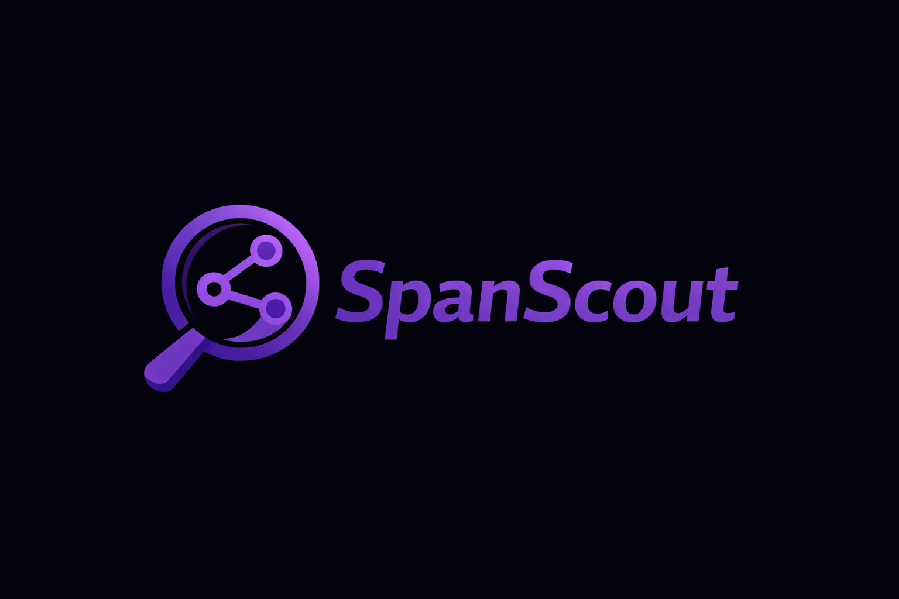

<p align="center">  </p>

# SpanScout

**SpanScout** is a developer-first **observability platform prototype**.

The project demonstrates a **self-hosted telemetry ingestion architecture** with:

* instrumented services
* a telemetry ingestion gateway
* a control plane for projects and API keys
* an OpenTelemetry observability stack

Further information:

* Architecture → `docs/architecture.md`
* Project vision → `docs/vision.md`

---

# Repository Structure

```
spanscout/
│
├── apps/
│   ├── demo-service/
│   ├── worker-service/
│   ├── control-plane/
│   └── ingestion-gateway/
│
├── packages/
│   └── spanscout-node/
│
├── infra/
│   ├── docker/
│   │   └── docker-compose.yml
│   │
│   ├── otel/
│   │   └── otel-collector-config.yaml
│   │
│   ├── prometheus/
│   │   └── prometheus.yml
│   │
│   ├── tempo/
│   │   └── tempo.yaml
│   │
│   └── grafana/
│       ├── dashboards/
│       └── provisioning/
│
├── docs/
│   ├── architecture.md
│   └── vision.md
│
├── README.md
└── .gitignore
```

---

# Prerequisites

Recommended development environment:

```
VS Code
WSL
Docker Desktop
Node.js
npm
Git
```

---

# Installation

Clone the repository:

```
git clone <repo-url>
cd spanscout
```

Install dependencies:

```
cd apps/demo-service
npm install

cd ../worker-service
npm install

cd ../ingestion-gateway
npm install

cd ../control-plane
npm install
```

---

# Run the Project

To ensure **complete traces are visible**, all services must be running.

---

## 1 Start Observability Stack

```
cd infra/docker
docker compose up -d
```

Starts:

* Grafana
* Prometheus
* Tempo
* Loki
* OpenTelemetry Collector
* PostgreSQL

---

## 2 Start Control Plane

```
cd apps/control-plane
npm run start:dev
```

Port:

```
localhost:3001
```

---

## 3 Start Ingestion Gateway

```
cd apps/ingestion-gateway
npm run dev
```

Port:

```
localhost:3002
```

The gateway receives telemetry from services and forwards it to the observability stack.

---

## 4 Start Worker Service

```
cd apps/worker-service
npm run dev
```

---

## 5 Start Demo Service

```
cd apps/demo-service
npm run dev
```

Port:

```
localhost:8080
```

---

# Test the Services

Hello endpoint

```
curl http://localhost:8080/hello
```

Generate a distributed trace

```
curl http://localhost:8080/slow
```

Generate multiple traces

```
for i in {1..5}; do curl http://localhost:8080/slow; done
```

---

# SpanScout SDK (Service Integration)

SpanScout provides a simple Node.js SDK for integrating your own services.

---

## 1 Install Package

```
npm install @spanscout/node dotenv
```

---

## 2 Configure Environment

Create a `.env` file:

```
OTEL_SERVICE_NAME=your-service-name
SPANSCOUT_API_KEY=your_api_key
SPANSCOUT_TRACES_ENDPOINT=http://localhost:3002/v1/traces
```

---

## 3 Enable Instrumentation

Add this at the top of your application:

```ts
import "dotenv/config";
import "@spanscout/node/register";
```

---

## 4 Start Service

```
npm run dev
```

---

## 5 View Trace

Grafana:

```
http://localhost:3000
```

There you will see:

* demo-service
* worker-service
* ingestion-gateway
* control-plane

---

# Stop the Project

Stop Node services

```
CTRL + C
```

Stop Docker stack

```
cd infra/docker
docker compose down
```

Docker volumes are preserved so that databases and dashboards are not lost.
